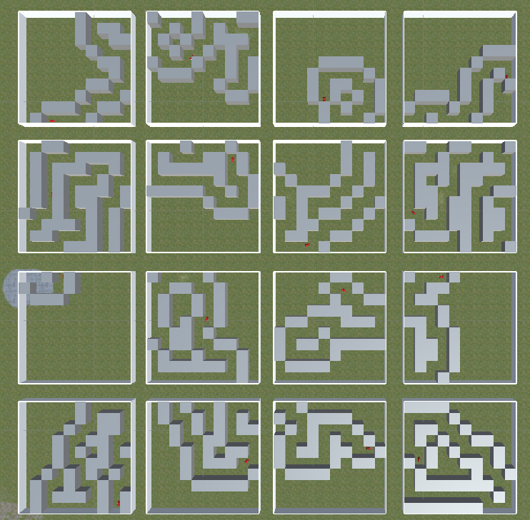

# Autonomous Driving AI

Just-for-fun side project trying to teach a car driving using RL. The code uses a quite realistic car model that includes nonlinearities such as skidding etc. 

### The learning environment: 

16 cars in parallel on randomized trajectories. The episode ends when a wall is hit and a new trajectory is generated.

## Usage

This project requires Unity Editor version 2021.3.15f1 and ML Agents 2.0.1. To see the learning environment, navigate to `Assets/Scenes` and open `main (car).unity`.
